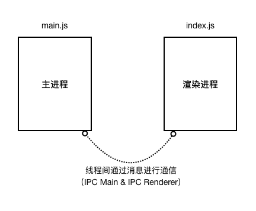
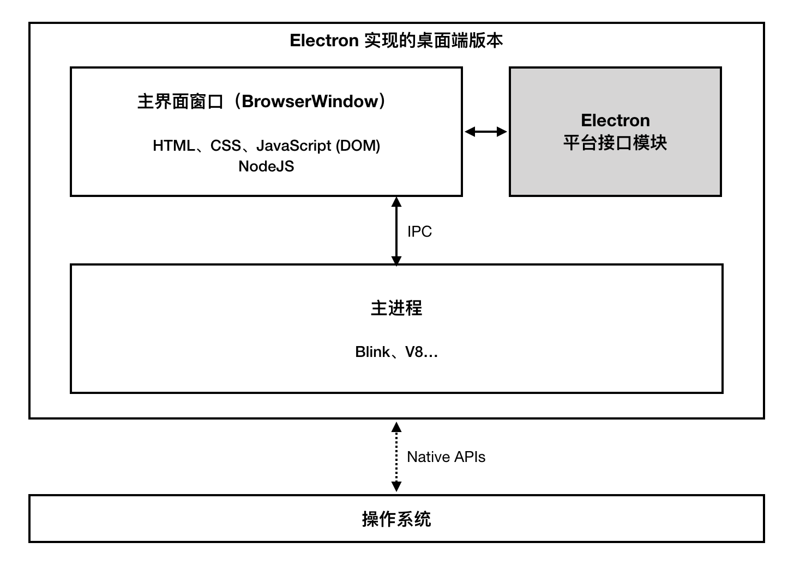
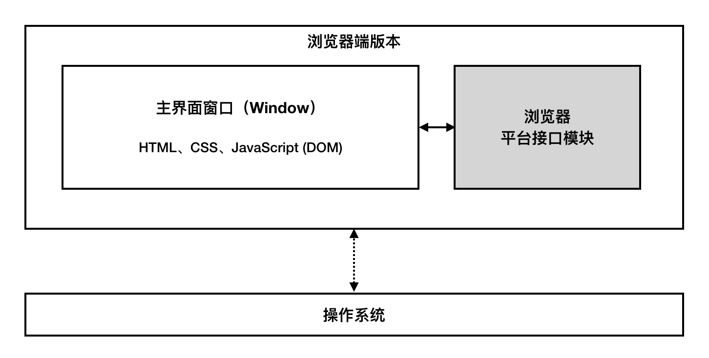
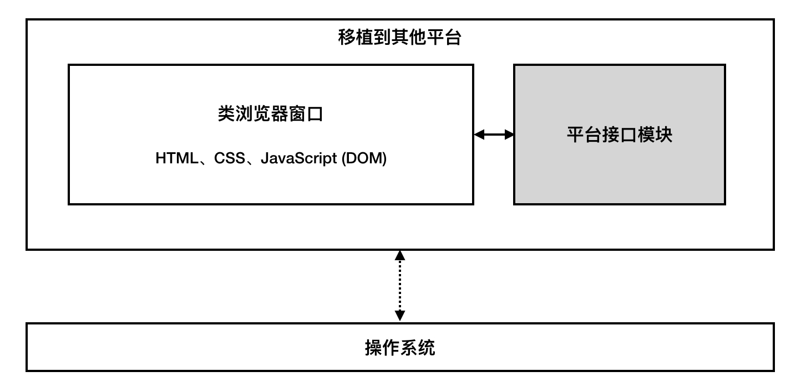
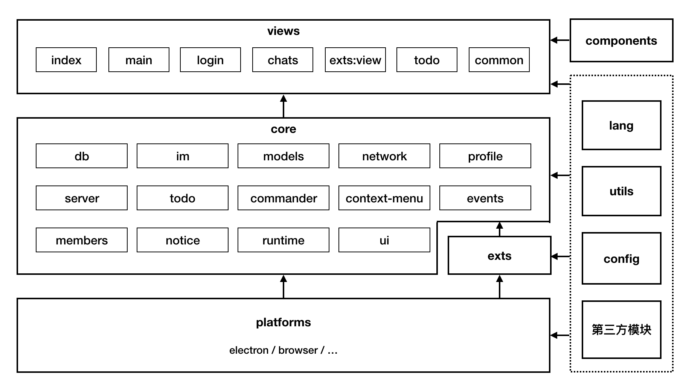

# 客户端架构

本文主要讲述客户端开发所使用到的技术，关键模块以及项目源码结构。

## 实现技术

喧喧是一个开源的企业即时通讯解决方案，官方客户端的实现主要遵从如下目标：

1. **尽可能支持更多平台**：客户端应该能够在 Windows、Mac 和 Linux 等多个平台上运行，并且容易迁移到其他平台上；
2. **使用开源依赖模块**：除非用户自己定制的部分，客户端所使用的框架和依赖模块都应该来自于同样使用开源许可协议的项目；
3. **易于进行二次开发**：用户能够非常容易的理解喧喧客户端所使用的技术，非常方便的利用流行技术进行二次开发。

依据上述目标，喧喧客户端主要使用到了如下关键技术：

* **HTML/JS/CSS**：借助 HTML/JS/CSS 技术来实现美观易用的现代化界面和交互逻辑，可以非常方便的让喧喧运行在任何浏览器环境或者类浏览器环境（例如 [Electron](https://electronjs.org/) 或 [NWJS](https://nwjs.io/)）；
* **Electron**：[Electron](https://electronjs.org/) 结合了 Node.js 和 Chrome 运行环境，为跨平台应用提供了功能强大的框架，借助 Electron，喧喧桌面端版本在 Windows、Mac 和 Linux 保证拥有相同的完整到功能体验；
* **Node.js**：Electron 在应用运行时提供了 [Node.js](https://nodejs.org/zh-cn/) 运行环境，使得桌面版可以访问桌面操作系统原生功能，同时 Node.js 环境还是项目开发时辅助工具脚本的运行环境；
* **npm**：[npm](https://www.npmjs.com/) 作为项目到包管理工具，是进行 Node.js 开发的不二之选，同时 [npm 网站](https://www.npmjs.com/)上拥有世界上最大到软件注册表，可以非常方便的获取第三方开源模块；
* **webpack**：[webpack](https://webpack.js.org/) 是一个现代 JavaScript 应用程序的静态模块打包器(module bundler)，喧喧客户端项目正是依赖 Webpack 来将应用中用到的 JS、CSS、图片等资源打包到一个集中的目录中，方便 Electron 进行调用；
* **React**：[React](https://reactjs.org/) 是一个用于构建用户界面的 JavaScript 库，其组件式开发方式非常适合复杂界面的开发，并且页方便进行二次开发。

## 平台实现

目前官方提供了喧喧客户端在两个平台上的实现：Electron 和 浏览器。其中 Electron 为桌面端版本主要依赖框架，使得喧喧同时支持 Windows、Mac 和 Linux 三大操作系统平台。浏览器端实现了喧喧的基础聊天功能，不包括需要操作系统本地化支持的功能（例如截图、扩展机制等）。浏览器端版本实现了在任何能够运行现代浏览器的平台上使用喧喧，包括 Windows、Mac、 Linux、Android 以及 iOS 平台。开发者也可以将喧喧移植到其他类浏览器环境的平台上，例如 [NWJS](https://nwjs.io/) 或 [Chrome 扩展应用](https://chrome.google.com/webstore/category/apps?hl=zh-CN)。

### 多平台实现原理

喧喧应用程序核心模块只需要一个基本的浏览器环境即可。当具体的平台被实现时会提供一个平台接口模块，一些依赖平台的特殊功能（例如从剪切板读取图片）在调用之前会先询问平台接口模块，如果平台接口模块已经提供了此功能则使用平台提供的功能，如果平台不提供此功能则会使用降级实现的替代方法或者从用户界面上移除此功能的使用入口。

### Electron 平台

Electron 是由 Github 开发，使用用 HTML，CSS 和 JavaScript 来构建跨平台桌面应用程序的一个开源框架。 Electron 通过将 Chromium 和 Node.js 合并到同一个运行时环境中，并将其打包为 Mac，Windows 和 Linux 系统下的应用来实现这一目的。

#### 主进程和渲染进程

Electron 有两个进程，分别为 main 和 renderer，而两者之间是通过 ipc 进行通讯。main 端有 ipcMain，renderer 端有 ipcRenderer，分别用于通讯。

Electron 运行 `package.json` 的 main 脚本的进程被称为 **主进程**。 在主进程中运行的脚本通过创建 web 页面来展示用户界面。 一个 Electron 应用总是有且只有一个主进程。

由于 Electron 使用了 Chromium 来展示 web 页面，所以 Chromium 的多进程架构也被使用到。 每个 Electron 中的 web 页面运行在它自己的 **渲染进程** 中。

在普通的浏览器中，web页面通常在一个沙盒环境中运行，不被允许去接触原生的资源。 然而 Electron 的用户在 Node.js 的 API 支持下可以在页面中和操作系统进行一些底层交互。

主进程使用 BrowserWindow 实例创建页面。 每个 BrowserWindow 实例都在自己的渲染进程里运行页面。 当一个 BrowserWindow 实例被销毁后，相应的渲染进程也会被终止。

主进程管理所有的 Web 页面和它们对应的渲染进程。 每个渲染进程都是独立的，它只关心它所运行的 web 页面。

喧喧桌面客户端基于 Electron 实现，在 Electron 主进程中实现启动喧喧主界面窗口（渲染进程），并负责与操作系统桌面环境进行集成（显示桌面弹出通知等）。在当前版本中，一个 Electron 应用实例只会启动一个渲染进程来显示主界面窗口。主进程会监听渲染进程中的消息，以便响应一些需要主进程与操作系统交互的操作，例如在通知栏显示并闪烁应用程序图标。

#### Electron 的 API

Electron 在主进程和渲染进程中通过 `electron` 模块提供了大量实用 API 来帮助实现与桌面环境的交互。一些 API 仅仅在主进程中提供，例如设置操作系统桌面通知栏图标，一些 API 同时在主进程和渲染进程中提供，例如读写系统剪切板。喧喧桌面客户端使用这些 API 使得应用更好的与系统环境进行集成，提供更佳的使用体验。

#### Node.js 环境

因为 Electron 还提供了 Node.js 运行环境，所以在主进程和渲染进程中都可以随时使用 Node.js 的 API，例如使用 [`fs`](https://nodejs.org/docs/latest-v8.x/api/fs.html) 模块来实现访问系统文件系统。

#### 依赖版本

目前桌面客户端所依赖的 Electron 版本为 `2.0.5`。该版本所提供的 Chrome 版本为 `61.0.3163.100`，Node.js 版本为 `8.9.3`，V8 版本为 `6.1.534.41`。

Electron 项目会不断更新新的版本，在喧喧客户端项目中也会定期升级所依赖的 Electron 版本。

### 浏览器平台

喧喧客户端也提供了对纯浏览器平台的支持，相比较 Electron 平台，纯浏览器端版本去掉了对 [Electron API](#Electron 的 API) 和 Node.js 的依赖，因此相对应的一些功能也会被去掉，例如无法提供截图功能。

#### 支持的浏览器版本

目前喧喧的浏览器端版本支持目前所有流行浏览器的最新版本。

### 移植到其他平台

因为喧喧应用核心模块不涉及到平台模块，所以可以将喧喧移植到其他平台上，只需要提供对应平台上的接口模块即可。

### 跨系统平台

因为 Electron 和浏览器都天生具备跨系统平台特性，所以基于以上技术实现的喧喧应用客户端也具备跨系统平台特性。

## 模块

### 关键模块

喧喧客户端应用主要包含如下关键模块：

* `components`：公共组件模块（React 实现）；
* `config`：运行时配置项管理模块；
* `core`：喧喧核心功能模块，包含事件机制、界面管理、网络、用户资料、数据库、聊天功能等子模块；
* `exts`：扩展机制模块；
* `lang`：多语言文本管理模块；
* `platform`：平台接口模块；
* `utils`：工具模块；
* `views`：界面模块（大部分为 React 组件形式实现）。

#### 核心功能模块

在核心功能模块（`core`）中包含如下子模块：

* `db`：数据库管理模块；
* `im`：聊天管理模块；
* `models`：实体类模块；
* `network`：网络访问模块；
* `profile`：用户资料管理模块；
* `server`：Socket 服务管理模块；
* `todo`：待办管理模块；
* `commander`：命令注册管理模块；
* `context-menu`：上下文菜单注册模块；
* `events`：消息事件管理模块；
* `members`：服务器成员管理模块；
* `notice`：界面通知模块；
* `runtime`：运行时管理模块；
* `ui`：界面操作模块。

#### 界面模块

依赖 React 的声明式组件形式，应用中的界面也使用组件来进行管理，在界面模块（`components`）中分别包含有如下几大类型的组件：

* `index`：界面框架相关组件；
* `main`：应用主界面相关组件；
* `login`：登录界面相关组件；
* `chats`：与聊天界面相关的组件；
* `exts`：扩展机制相关的组件；
* `todo`：待办功能相关的组件；
* `common`：公共的通用组件。

#### 平台接口模块

平台接口模块（`platform`）包含了为特定平台上实现喧喧功能提供的一系列接口。官方已经实现的平台接口模块包括：

* `electron`：基于 Electron 环境实现平台的接口；
* `browser`：基于纯浏览器端环境实现平台的接口。

一个平台接口模块应该实现为一个 JS 对象，对象中的属性对应了实现的接口。当前版本中，已经定义的接口属性字段包括：

* `type`: 一个字符串表示的平台类型名称，例如 `'electron'`；
* `env`：提供平台环境相关信息，例如操作系统类型；
* `screenshot`：提供截图相关功能；
* `contextmenu`：提供界面上右键菜单实现功能；
* `EventEmitter`：提供一个事件触发器类实现；
* `image`：提供图片相关操作方法；
* `ui`：提供界面窗口操作方法；
* `shortcut`：提供全局快捷键实现；
* `dialog`：提供系统对话框实现；
* `fs`：提供系统文件访问实现；
* `config`：提供用户配置存储实现；
* `sound`：提供界面声音播放实现；
* `net`：提供网络 http(s) 请求管理；
* `crypto`：提供加密解密操作方法；
* `Socket`：提供 WebSocket 类实现；
* `notify`：提供界面通知相关操作方法；
* `clipboard`：提供剪切板相关操作方法；
* `webview`：提供 WebView 初始化方法。

这些属性字段对应的接口并不需要全部提供，部分接口可以省略，核心模块在调用平台接口时会进行接口检查，如果平台接口模块已经提供了此功能则使用平台提供的功能，如果平台不提供此功能则会使用降级实现的替代方法或者从用户界面上移除此功能的使用入口。

### 第三方模块

另外还使用到了一些第三方模块：

* [`aes-js`](https://www.npmjs.com/package/aes-js)：AES 加密解密算法的 JS 实现；
* [`cheerio`](https://www.npmjs.com/package/cheerio)：类 jQuery API 在 Node.js 上的实现；
* [`clipboard-js`](https://www.npmjs.com/package/clipboard-js)：提供在浏览器上读写剪切板的 API；
* [`compare-versions`](https://www.npmjs.com/package/compare-versions)：比较版本号工具模块；
* [`dexie`](https://www.npmjs.com/package/dexie)：IndexDB 数据库包装模块；
* [`draft-js`](https://www.npmjs.com/package/draft-js)：富文本编辑器组件；
* [`electron-debug`](https://www.npmjs.com/package/electron-debug)：为 Electron 增加一些调试特性；
* [`emojione`](https://www.npmjs.com/package/emojione)：Emojione 实现的 Emoji 表情转换模块；
* [`emojione-picker`](https://www.npmjs.com/package/emojione-picker)：Emojione 表情选择面板组件；
* [`extract-zip`](https://www.npmjs.com/package/extract-zip)：zip 文件解压模块；
* [`fs-extra`](https://www.npmjs.com/package/fs-extra)：Node.js 内置 `fs` 模块端 Promise 实现；
* [`highlight.js`](https://www.npmjs.com/package/highlight.js)：代码文本高亮转换模块；
* [`hotkeys-js`](https://www.npmjs.com/package/hotkeys-js)：界面快捷键管理模块；
* [`htmlparser`](https://www.npmjs.com/package/htmlparser)：HTML 快速解析模块；
* [`ion-sound`](https://www.npmjs.com/package/ion-sound)：音频文件播放控制模块；
* [`marked`](https://www.npmjs.com/package/marked)：Markdown 模块；
* [`md5`](https://www.npmjs.com/package/md5)：MD5 算法实现模块；
* [`pinyin`](https://www.npmjs.com/package/pinyin)：汉字转拼音模块；
* [`prop-types`](https://www.npmjs.com/package/prop-types)：React 属性类型检查模块；
* [`react`](https://www.npmjs.com/package/react)：React 用户界面框架；
* [`react-dom`](https://www.npmjs.com/package/react-dom)：React 用户界面框架；
* [`react-router-dom`](https://www.npmjs.com/package/react-router-dom)：React 路由组件；
* [`react-split-pane`](https://www.npmjs.com/package/react-split-pane)：分栏组件；
* [`recordrtc`](https://www.npmjs.com/package/recordrtc)：使用 WebRTC 录屏模块（用于 Electron 截图功能）；
* [`remove-markdown`](https://www.npmjs.com/package/remove-markdown)：Markdown 转纯文本模块；
* [`source-map-support`](https://www.npmjs.com/package/source-map-support)：Source map 支持模块；
* [`uuid`](https://www.npmjs.com/package/uuid)：RFC4122 UUID 生成工具；
* [`wolfy87-eventemitter`](https://www.npmjs.com/package/wolfy87-eventemitter)：类 Node.js 事件触发器（EventEmitter）在浏览器端的实现；
* [`ws`](https://www.npmjs.com/package/ws)：WebSocket 在 Node.js 上的实现。

一些模块仅仅在特定的平台上被依赖，例如 `ws` 模块仅仅在 Electron 平台上被用于实现 Socket 连接。

### 模块依赖关系

这些模块的依赖关系如下：

## 网络连接

喧喧客户端应用中使用到了 WebSocket 和 https 两种网络连接形式。在现代 Web 浏览器中这两种形式都得到很好的支持。浏览器 JS 环境中的 [WebSocket](https://developer.mozilla.org/zh-CN/docs/Web/API/WebSocket) 类实现了对 WebSocket 连接的管理；[Fetch API](https://developer.mozilla.org/zh-CN/docs/Web/API/Fetch_API) 和 [XMLHttpRequest（XHR）对象](https://developer.mozilla.org/zh-CN/docs/Web/API/XMLHttpRequest) 实现对 HTTP 协议连接的支持。

## 数据存储

在喧喧客户端应用中使用到了本地存储（localStorage）和数据库（IndexDB 实现）两种数据存储形式。

### 本地存储（localStorage）

本地存储由浏览器的 [Web Storage API](https://developer.mozilla.org/zh-CN/docs/Web/API/Web_Storage_API/Using_the_Web_Storage_API) 实现。本地存储形式为简单的键值对，主要用于存储客户端内登录过的用户信息。当登录过的用户再次登录时，可以将保存的用户展示出来供用户切换并快捷登录使用。

### 数据库（IndexDB）

喧喧客户端应用会缓存用户接收到的消息并将消息存储到数据库。数据库使用现代浏览器广泛支持的 [IndexDB API](https://developer.mozilla.org/zh-CN/docs/Web/API/IndexedDB_API) 实现。在客户端应用中并不直接访问 IndexDB 数据库，而是使用 [`Dexie `](https://www.npmjs.com/package/dexie) 模块来实现。Dexie 对 IndexDB 进行了包装，提供更友好的 API。区别于传统数据库，Dexie 实现了允许直接存储 JS 对象，并且可以分开管理多个概念上独立的数据库。

### 跨平台性

本地存储和 IndexDB 数据库技术都是现代浏览器自带的特性，在使用他们的时候无需考虑各个平台上的差异。

## 界面外观实现

喧喧客户端主要基于 HTML/JS/CSS 实现，界面外观主要基于 CSS 进行定义，在官方实现中，使用了 CSS 的方言 [Less](http://lesscss.org/) 来定义外观，最终 Less 仍然会转换为 CSS。

## 参考

* [Electron 应用结构](https://electronjs.org/docs/tutorial/application-architecture)；
* [Electron API](https://electronjs.org/docs/api)；
* [Web Storage API](https://developer.mozilla.org/zh-CN/docs/Web/API/Web_Storage_API/Using_the_Web_Storage_API)；
* [使用 IndexDB](https://developer.mozilla.org/zh-CN/docs/Web/API/IndexedDB_API/Using_IndexedDB)；
* [Less](http://lesscss.org/)；
* [WebSocket 教程](http://www.ruanyifeng.com/blog/2017/05/websocket.html)；