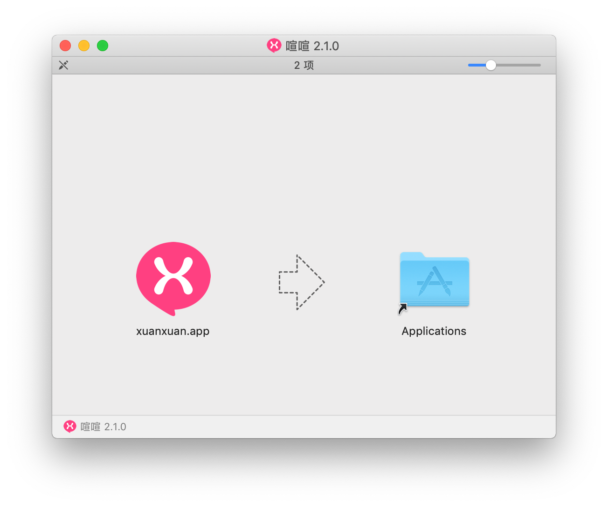
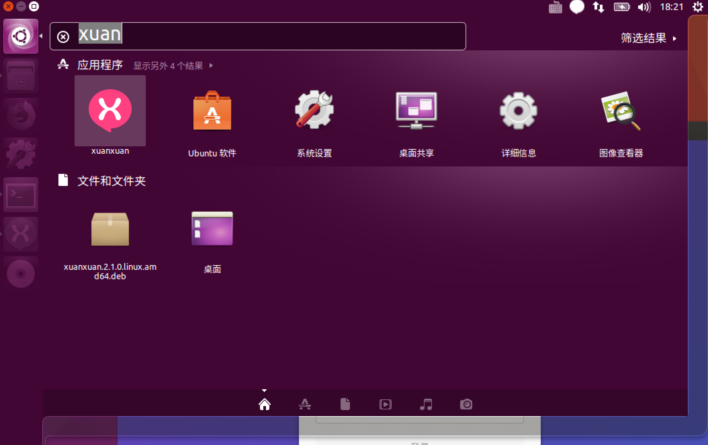

# 客户端安装

喧喧官方目前为如下平台提供了客户端：

* Windows（支持 Windows7 以上版本）；
* Mac OS（支持 OS X 10.8 以上版本）；
* Linux（Ubuntu 12.04 及更新、Fedora 21+、Debian 8）；
* 浏览器端（支持主流浏览器最新版本）；
* Android（Android Jelly Bean, v16, 4.1.x 或者更新的版本）；
* iOS（ iOS 8 或更新版本）。

## 桌面客户端

<!-- tabs:start -->

### ** Windows **

#### 安装步骤

1. 下载自己所使用的 Windows 版本安装包，以 Windows 64 位操作系统为例，下载地址为 [${downloadUrl}${version}/${name}.${version}.win64.setup.exe](${downloadUrl}${version}/${name}.${version}.win64.setup.exe)；
2. 在资源管理器找到下载的文件 `${name}.${version}.win64.setup.exe`，点击此文件进行运行，按照安装向导程序提示进行安装；
3. 安装完成之后就可以在桌面上找到 `${name}` 的程序图标，双击程序图标即可运行。

#### Windows 所有可用安装包下载地址

| 安装包类型           | Windows 64 位系统                                            | Windows 32 位系统                                            |
| -------------------- | ------------------------------------------------------------ | ------------------------------------------------------------ |
| 安装向导程序         | [${name}.${version}.win64.setup.exe](http://dl.cnezsoft.com/${name}/${version}/${name}.${version}.win64.setup.exe) | [${name}.${version}.win32.setup.exe](http://dl.cnezsoft.com/${name}/${version}/${name}.${version}.win32.setup.exe) |
| 程序压缩包           | [${name}.${version}.win64.zip.exe](http://dl.cnezsoft.com/${name}/${version}/${name}.${version}.win64.zip.exe) | [${name}.${version}.win32.zip.exe](http://dl.cnezsoft.com/${name}/${version}/${name}.${version}.win32.zip.exe) |
| Debug 版安装向导程序 | [${name}.${version}.win.debug.setup.exe](http://dl.cnezsoft.com/${name}/${version}/${name}.${version}.win.debug.setup.exe) |                                                              |

### ** Mac OS **

#### 安装步骤

1. 下载适合 Mac OS 的 dmg 安装镜像文件，下载地址为 [${downloadUrl}${version}/${name}.${version}.mac.dmg](${downloadUrl}${version}/${name}.${version}.mac.dmg)；
2. 在访达（Finder）中找到下载的文件 `${name}.${version}.mac.dmg`，双击载入镜像文件，在桌面找到 `${displayName} ${version}` 镜像文件图标，双击打开；
3. 将镜像文件夹中的 `xuanxuan.app` 文件拖放到 `Applications` 文件夹即可，在应用文件夹点击 `xuanxuan.app` 即可运行。
   

### ** Linux **

喧喧为 Linux 提供了 `tar.gz`、`deb` 和 `rpm` 三种不同的安装包格式，分别适用于不同的 Linux 系统。

#### 安装步骤

下面以使用 `deb` 安装在 Ubuntu 64 位操作系统上安装为例，假设下载。

1. 下载适合 Ubuntu 64 `deb` 文件，下载地址为 [${downloadUrl}${name}/${version}/${name}.${version}.linux.amd64.deb](${downloadUrl}${name}/${version}/${name}.${version}.linux.amd64.deb)；
2. 打开命令行终端执行：
   ```bash
   $ sudo dpkg -i ${name}.${version}.linux.amd64.deb
   ```
3. 在应用菜单中找到 `${name}` 应用，点击运行即可。



如果是第一次安装，执行上面的第 2 步时可能会出现 ``，这时则需要先安装缺失的依赖包，在命令行终端执行：

```bash
$ sudo apt-get -f install libappindicator1 libindicator7
```

然后再执行第 2 步操作即可。

#### Linux 所有可用安装包下载地址

| 安装包类型           | Windows 64 位系统                                            | Windows 32 位系统                                            |
| -------------------- | ------------------------------------------------------------ | ------------------------------------------------------------ |
| `tar.gz` 安装包 | [${name}.${version}.linux.x64.tar.gz](${downloadUrl}${name}/${version}/${name}.${version}.linux.x64.tar.gz) | [${name}.${version}.linux.ia32.tar.gz](${downloadUrl}${name}/${version}/${name}.${version}.linux.ia32.tar.gz) |
| `deb` 安装包 | [${name}.${version}.linux.amd64.deb](${downloadUrl}${name}/${version}/${name}.${version}.linux.amd64.deb) | [${name}.${version}.linux.i386.deb](${downloadUrl}${name}/${version}/${name}.${version}.linux.i386.deb) |
| `rpm` 安装包 | [${name}.${version}.linux.x86_64.rpm](${downloadUrl}${name}/${version}/${name}.${version}.linux.x86_64.rpm) | [${name}.${version}.linux.i686.rpm](${downloadUrl}${name}/${version}/${name}.${version}.linux.i686.rpm) |

<!-- tabs:end -->

## 浏览器端客户端

浏览器端客户端参考 [浏览器端部署文档](client/browser-deploy.md)。

## 移动客户端

移动客户端并非喧喧开源计划中的项目，但官方仍然提供了免费的移动客户端供大家使用。喧喧移动客户端支持登录 2.2.0 以上的服务器。

<!-- tabs:start -->

### ** Android 用户 **

扫描下面的二维码进行安装：


或者点击下面的链接下载 `.apk` 文件传输到手机进行安装：

* ${downloadUrl}/${version}.${version}.android.apk

### ** iPhone/iPad 用户 **

iPhone/iPad 用户扫描下面的二维码进行安装：


或者在 [AppStore](https://www.apple.com/cn/ios/app-store/) 上搜索 “**喧喧**” 选择第一个搜索结果进行安装即可。

<!-- tabs:end -->

你也可以通过学习喧喧的技术架构来实现自己的移动客户端。
