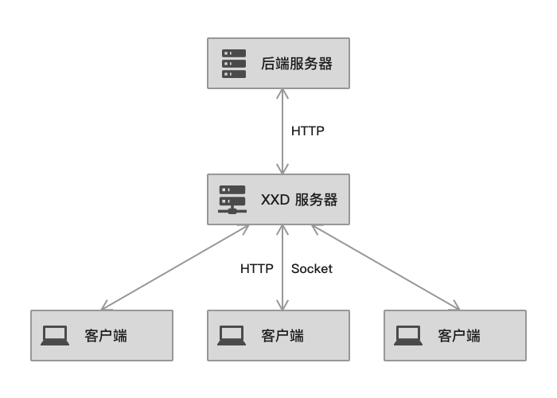
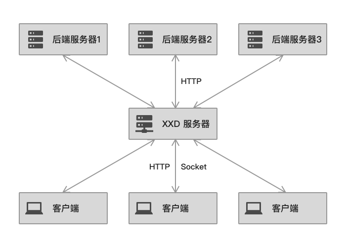
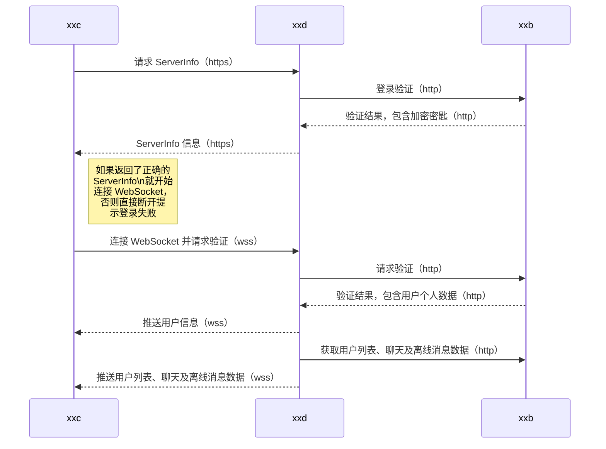
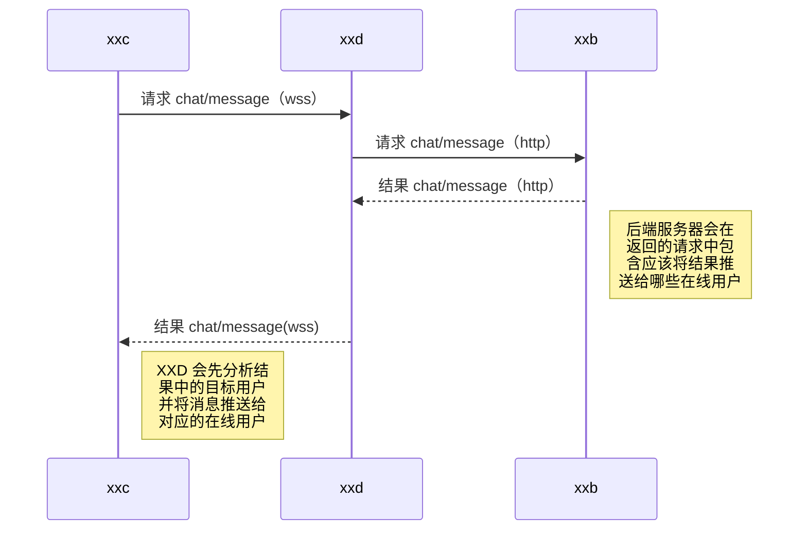
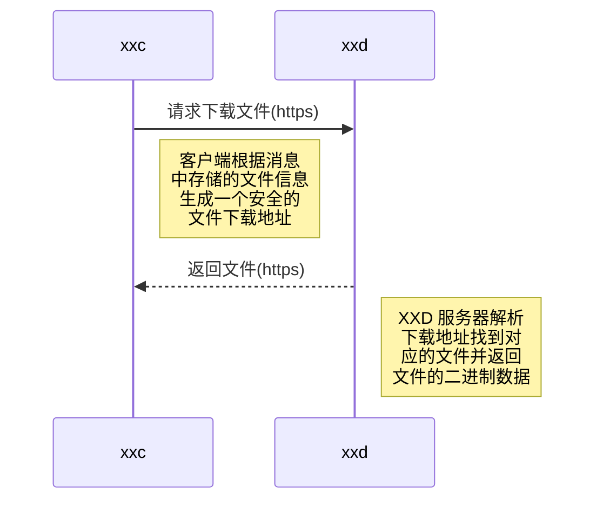

# 架构

本文将介绍喧喧整体技术架构和实现方案。

## 目标

喧喧即时通信解决方案目标有：

* **多平台支持**：服务器支持任意系统平台部署，客户端支持在任意平台上使用；
* **交互体验**：实现无延迟的聊天体验；
* **安全性**：保证通信安全性，禁止第三方截获消息；
* **性能**：支持大量用户同时在线使用；
* **可扩展性**：采用通用技术，方便进行二次开发；
* **集成**：易于与已有系统进行集成。

## 方案

喧喧即时通信解决方案包含三个部分：

1. **客户端（`xxc`）**：提供最终用户使用的交互界面；
3. **后端服务器（`xxb`）**：提供聊天数据存储以及供客户端使用的接口，以及喧喧服务器管理界面。
2. **XXD 服务器（`xxd`）**：作为中间守护服务器，提供文件上传下载管理、协调客户端与后端服务器通信。

客户端通过 Socket 连接到 XXD 服务器；XXD 服务器负责管理所有已连接的客户端，并且随时将客户端相关信息通过 HTTP 协议汇报给后端服务器；客户端并不直接与后端服务器通信，而且将消息发送给 XXD 服务器，XXD 服务器接收到客户端消息后立即将消息发送给后端服务器；后端服务器如果有消息要推送给客户端需要先发送给 XXD 服务器，然后 XXD 服务器将后端服务器的消息再推送给客户端。在以上三方直接存在 2 中通信协议：

* **Socket**：客户端与 XXD 服务器直接使用 Socket 协议连接（文件上传下载除外），可以实现实时通信，将用户聊天过程中的延迟降至最低；
* **HTTP**：XXD 服务器与后端服务器通过 HTTP 协议通信，HTTP 协议具有广泛的支持，并且使用简单，这样用户更容易将喧喧集成到自己的系统中。

通常情况下客户端、后端服务器和 XXD 服务器的关系如下：

一个 XXD 服务器还可以链接到多个后端服务器，这样可以实现集群部署：

## 技术实现

### 后端服务器实现

后端服务器采用 [php](http://www.php.net/) + [mysql](https://www.mysql.com/cn/) 开发，使用 [ZentaoPHP](http://devel.cnezsoft.com/page/zentaophp.html) 作为开发框架，非常方便的进行二次开发。

### XXD 服务器实现

XXD 服务器端采用 [Go 语言](https://golang.org/)实现。Go 语言具备高性能、支持高并发、易于学习使用，非常适合来开发中间守护服务器。

XXD 服务器使用到了 [go-sqlite3](https://github.com/mattn/go-sqlite3) 来实现服务器缓存功能。

### 客户端实现

客户端推荐采用 HTML/CSS/JS 实现，目前官方桌面客户端基于 Electron 开发。关于客户端架构参考 [“客户端架构”文档](client/arch.md)。

### 通信数据包

客户端与 XXD 服务器主要通过 Socket 连接进行通信，每一次通信通过数据包进行定义。一个数据包为一段经过加密的 JSON 对象字符串。该对象上具有如下属性字段：

* `v`：客户端版本号；
* `module`：操作模块，例如 `'chat'`；
* `method`：操作方法，例如 `'message'`；
* `params`：操作方法参数，以数组形式；
* `userID`：用户 ID；
* `data`：操作数据。

XXD 服务器接收到客户端发送的数据包之后会发送给后端服务器，后端服务器根据数据包内的模块和方法定义来调用基于 [ZentaoPHP](http://devel.cnezsoft.com/page/zentaophp.html) 框架上对应的模块和方法，并将处理结果以数据包的形式返回给 XXD 服务器再发送给客户端。

### 安全与加密

客户端与 XXD 服务器以及 XXD 服务器与后端服务器相互之间发送的任何数据都会进行加密。加密算法为 `aes-256-cbc`。加密和解密的密匙由 XXD 服务器上用户配置，初始化向量为密匙前 16 位字符。

除了传输数据包的 Socket 连接，有时客户端和 XXD 服务器还会通过 HTTP 协议，此时会启用 https 安全链接来达到加密目标。

## 典型场景

### 登录验证场景

登录验证场景流程如下图所示：

### 聊天场景

用户点击发送按钮后，客户端会将消息进行包装为 `chat/message` 数据包，并将消息打包加密通过 WebSocket 发送给 XXD 服务器；XXD 服务器将消息通过 http 请求转发给后端服务器（xxb），后端服务器收到消息之后会将消息进行存储，并标记应该发送给哪些在线用户，并将标记后的数据打包加密发送给 XXD；XXD 会分析结果中的目标用户，并将消息发送给对应的用户。完整聊天场景流程如下图所示：

### 文件下载

客户端上的文件下载主要通过客户端与 XXD 服务器之间的 HTTP 请求实现，主要流程如下图所示：

